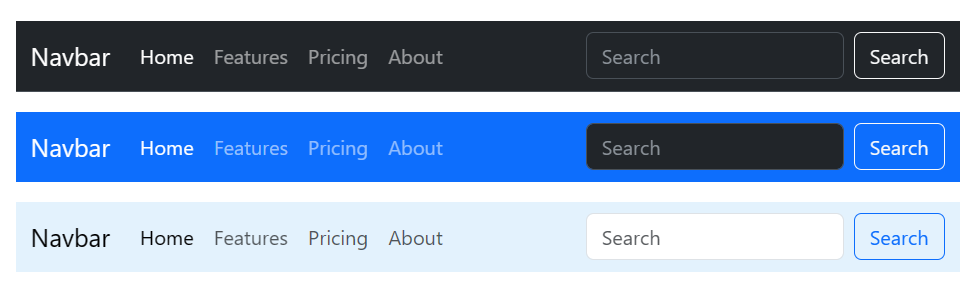

# Welcome to AKOSource!

Hey Mates! Welcome to **AKOSource**. It's an **Open Source** project made for website designers. Any developer can help us to build a better future with helping our mates (Beginners, Mid, or Pro) developers to make their site attractive and beautiful.

Let's get started with a new journey to Open-Source. Help us with your codes.
## Used By

This project is used by the following Developers:

- Web Designers
- Web Developers


## Tech Stack

**Languages:** HTML, CSS, JS

# Basics
Add these basic items in your code given below
## Add These Items in HTML file

```html
<!doctype html>
<html lang="en">
  <head>
    <meta charset="utf-8">
    <meta name="viewport" content="width=device-width, initial-scale=1">
    <title>Bootstrap demo</title>
    <link href="https://cdn.jsdelivr.net/npm/bootstrap@5.3.0/dist/css/bootstrap.min.css" rel="stylesheet" integrity="sha384-9ndCyUaIbzAi2FUVXJi0CjmCapSmO7SnpJef0486qhLnuZ2cdeRhO02iuK6FUUVM" crossorigin="anonymous">
  </head>
  <body>
    <h1>Hello, world!</h1>
    <script src="https://cdn.jsdelivr.net/npm/bootstrap@5.3.0/dist/js/bootstrap.bundle.min.js" integrity="sha384-geWF76RCwLtnZ8qwWowPQNguL3RmwHVBC9FhGdlKrxdiJJigb/j/68SIy3Te4Bkz" crossorigin="anonymous"></script>
  </body>
</html>
```

CSS embedding
```html
<head>
    <link href="https://cdn.jsdelivr.net/npm/bootstrap@5.3.0/dist/css/bootstrap.min.css" rel="stylesheet" integrity="sha384-9ndCyUaIbzAi2FUVXJi0CjmCapSmO7SnpJef0486qhLnuZ2cdeRhO02iuK6FUUVM" crossorigin="anonymous">
</head>
```

JS embedding

```html
<body>
    <script src="https://cdn.jsdelivr.net/npm/bootstrap@5.3.0/dist/js/bootstrap.bundle.min.js" integrity="sha384-geWF76RCwLtnZ8qwWowPQNguL3RmwHVBC9FhGdlKrxdiJJigb/j/68SIy3Te4Bkz" crossorigin="anonymous"></script>
  </body>
```

extra JS embeddings

```html
<script src="https://cdn.jsdelivr.net/npm/@popperjs/core@2.11.8/dist/umd/popper.min.js" integrity="sha384-I7E8VVD/ismYTF4hNIPjVp/Zjvgyol6VFvRkX/vR+Vc4jQkC+hVqc2pM8ODewa9r" crossorigin="anonymous"></script>
<script src="https://cdn.jsdelivr.net/npm/bootstrap@5.3.0/dist/js/bootstrap.min.js" integrity="sha384-fbbOQedDUMZZ5KreZpsbe1LCZPVmfTnH7ois6mU1QK+m14rQ1l2bGBq41eYeM/fS" crossorigin="anonymous"></script>
```

# Attractive Navbars

## Complete Navbar


> Note: <br>
> Just use the code in green comment as (Use this code only) <br>
> Also see the 2nd comment and read it carefully
>
> Note: <br>
> For changing colour use `data-bs-theme="dark"` after the `class="" data-bs-theme="dark"` dark or white or color codes like `class="" style="background-color: #e3f2fd;"`

[Click for code](./Navbars/Navbar_1.html)

## Brand
Here the brand name or logo will be shown

### Text


> Note: <br>
> Just use the code in green comment as (Use this code only) <br>

[Click for code](../AKOSource/Navbars/Navbar_2_brandtext.html)